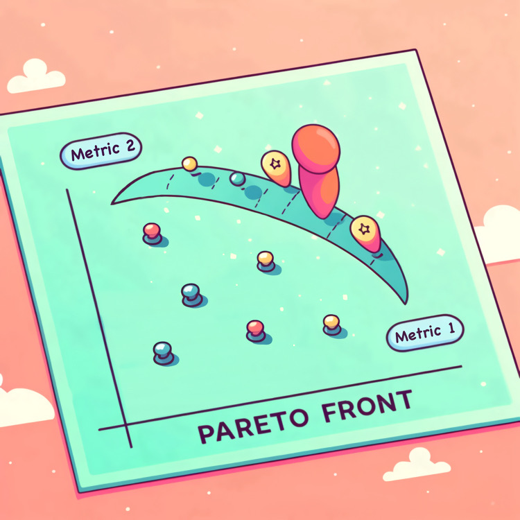
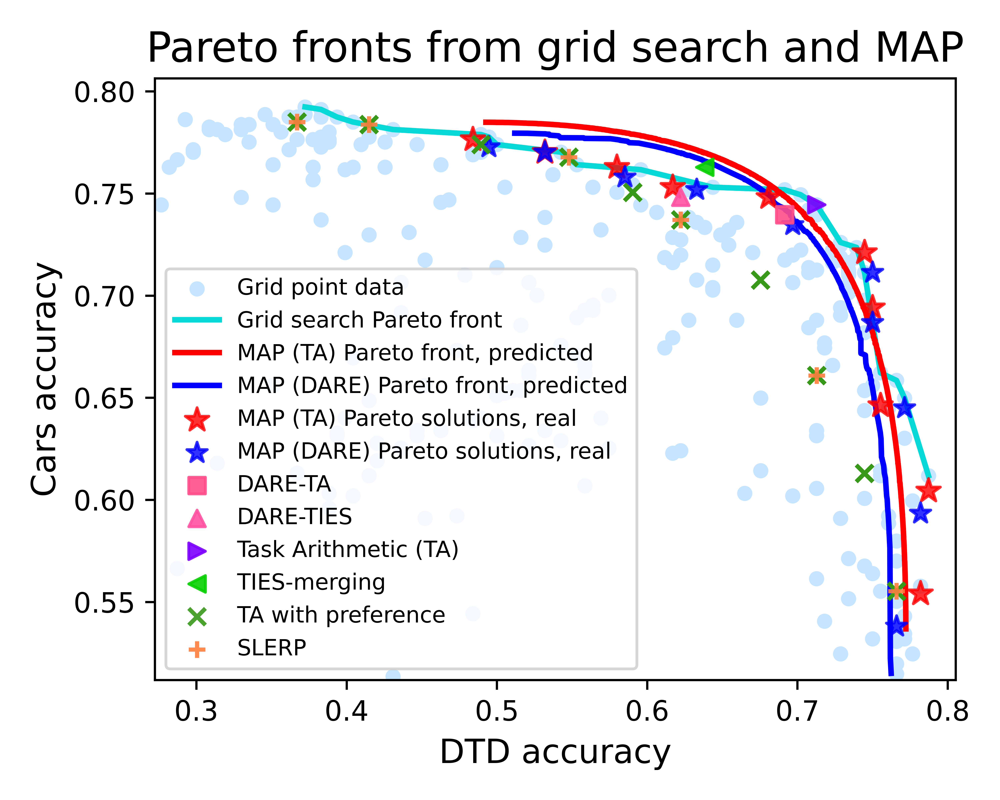
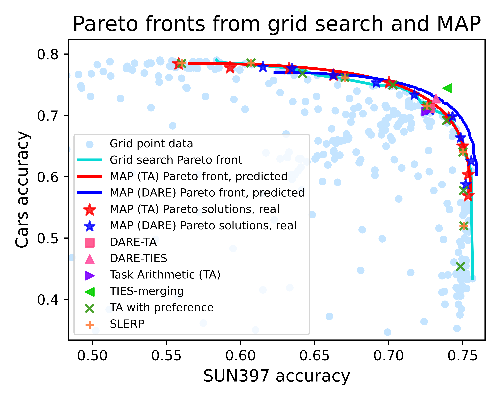
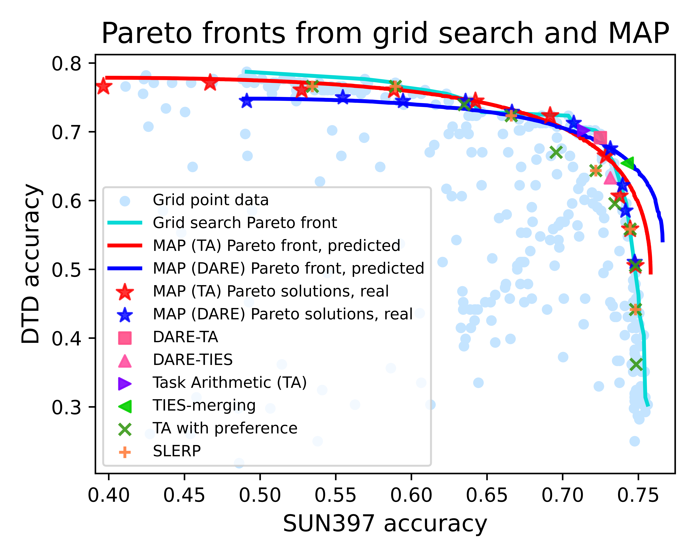
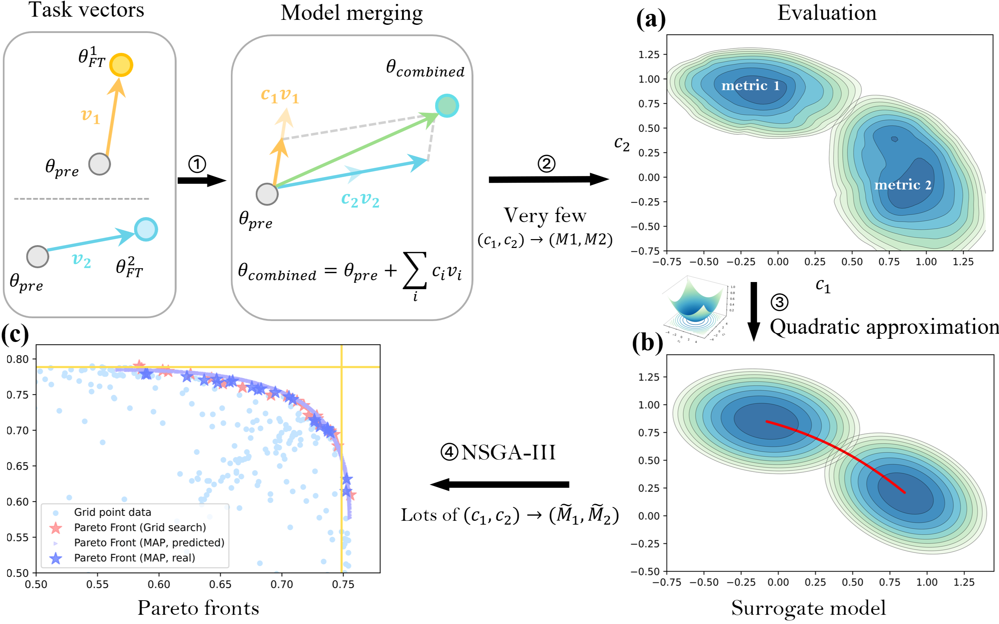
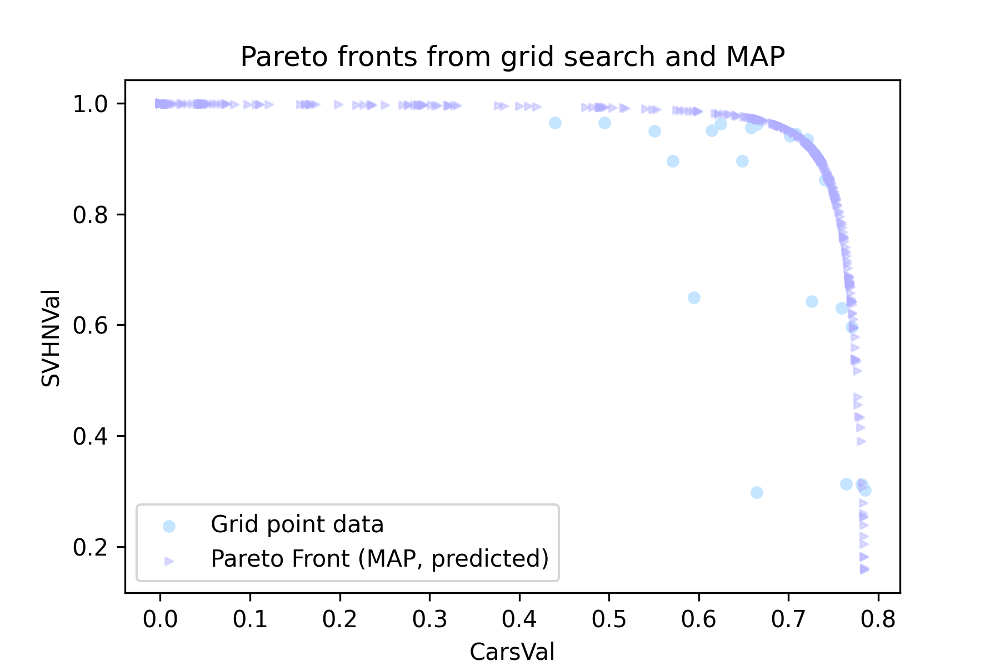
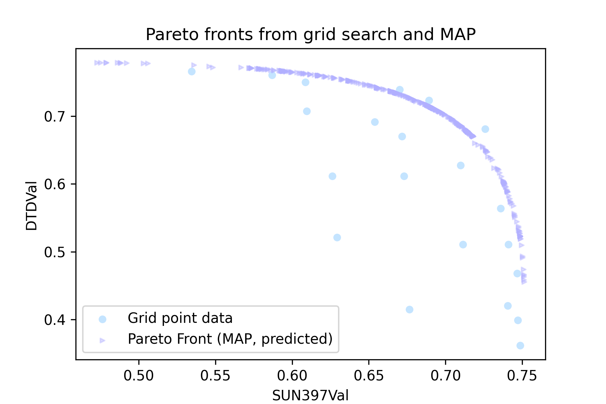
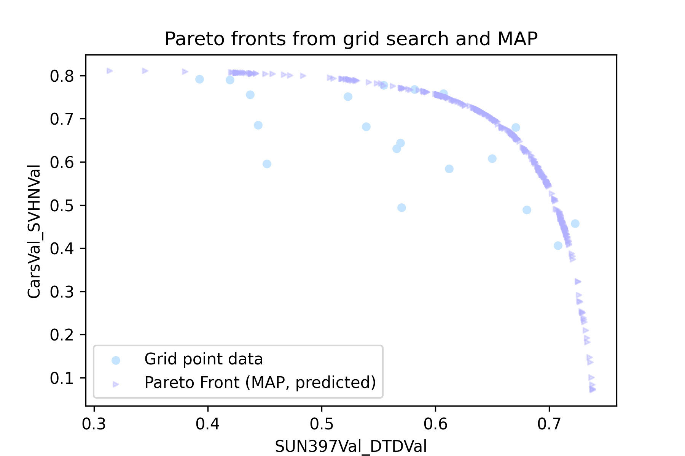

#  MAP: Low-compute Model Merging with Amortized Pareto Fronts via Quadratic Approximation
 
 
<div align="center">
  
</div>

 


 
## Code

### Quick Start

```bash
conda env create -f environment.yaml
conda activate map
git clone https://github.com/mlfoundations/task_vectors # we used the zero-shot task vectors from this repo
python run_MAP.py # check the args.py for the hyperparameters and 3 modes [map, bayesian, nested]
```
# Example Pareto fronts obtained by MAP and solutions obtained by baseline methods 
<table>
  <tr>
    <td>
      
      <br>
    </td>
    <td>
      
      <br>
    </td>
    <td>
      
      <br>
    </td>
  </tr>
</table>

# Overview

<p align="center">

</p>

The overall process of MAP under 2 tasks. 
- Step 1: select tasks and their corresponding task vectors. 
- Step 2: sample a few scaling weights $c$ to query the task metrics accordingly. 
- Step 3: use a quadratic model to approximate the mapping of $c \rightarrow \textit{metrics}$ as a surrogate model. 
- Step 4: use NSGA-III (or other multi-objective optimization algorithms) to find amortized Pareto fronts. 

Figure (a) shows the contour plots of the actual accuracy landscape for the ViT models obtained from 100 scaling coefficients (sampled uniformly) evaluated on the SUN397 and Cars. 

Figure (b) shows the contour plots of the fitted quadratic functions. Red lines represent the Pareto front in the decision variable $(c_1, c_2)$ space. 

Figure (c) shows an example of the Pareto Front. Pareto front (Grid search) is regarded as the ground truth given the enough number of grid points. Pareto front (MAP, predicted) is the amortized Pareto front. Pareto front (MAP, real) is the Pareto front involving the same $\{(c_1,c_2)\}$ but re-evaluated as to get the ground truth metrics as a comparison. The yellow lines are the evaluation performance of the fine-tuned single task models.


# Examples
## Nested merging

Given a preference weights vector `[a,b,c,d]`. In the following example, it is the `example_preferece.yaml` file. 

1. According to the losses on single task, first, we merge Cars and SVHN models according to the amortized Pareto Front and the preference `[a, b]`.
2. In the mean time, we merge SUN397 and DTD models according to the amortized Pareto Front and the preference `[c, d]`.
3. Finally, we merge the merged Cars+SVHN and SUN397+DTD models according to the amortized Pareto Front and the preference `[a + b, c + d]`.


<table>
  <tr>
    <td>
      
      <br>
      <div>Merge Cars and SVHN Models</div>
    </td>
    <td>
      
      <br>
      <div>Merge SUN397 and DTD Models</div>
    </td>
    <td>
      
      <br>
      <div>Merge SUN397+DTD and Cars+SVHN Models</div>
    </td>
  </tr>
</table>

### Run the 8-task nested merging

```bash
  python MAP/run_MAP.py \
    --zeroshot-merge-models SUN397Val CarsVal DTDVal SVHNVal EuroSATVal GTSRBVal RESISC45Val \
    --zeroshot-eval-datasets SUN397Val CarsVal DTDVal SVHNVal EuroSATVal GTSRBVal RESISC45Val \
    --preference example_preferece.yaml \
    --results-path nested_experiments8
```

```yaml
# Example of the example_preferece.yaml
{
    "SUN397Val": 1,
    "CarsVal": 2,
    "DTDVal": 6,
    "SVHNVal": 5,
    "EuroSATVal": 4,
    "GTSRBVal": 3,
    "RESISC45Val": 7
}
```
